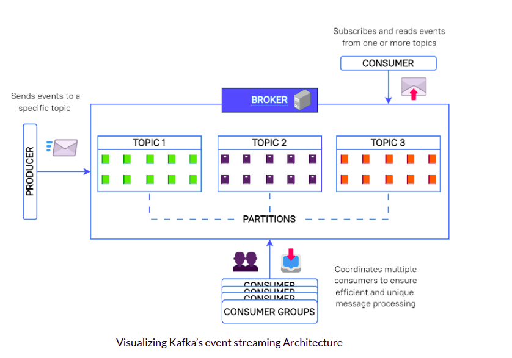

# Notes-1

## Blog -
https://www.freecodecamp.org/news/build-a-real-time-notification-system-with-go-and-kafka/

## Kafka

## Gin

### Gin Modes
- `Release Mode` -> Logs only what needs to be logged
- `Debug Mode` -> Logs all sorts of stuff that is useful during development.